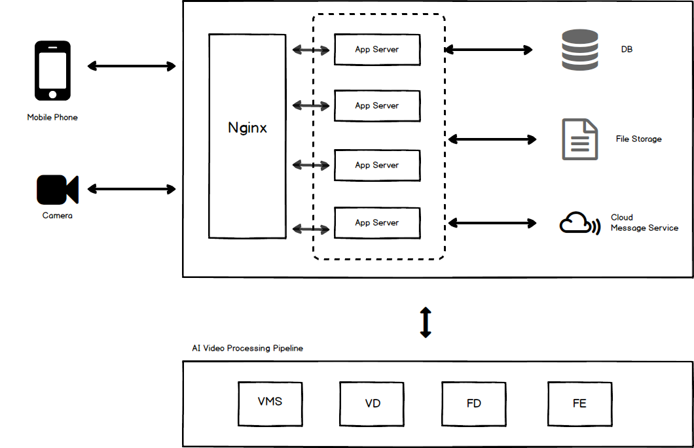

.. CamService documentation master file, created by
   sphinx-quickstart on Thu Aug 16 15:32:08 2018.
   You can adapt this file completely to your liking, but it should at least
   contain the root `toctree` directive.

AI Cam 解决方案文档
======================================

CamService's documentation

本文档主要介绍了AI 摄像头Solution 的架构
包括了 后台服务 和 人脸识别系统 和 用户手机端APP

系统结构
-----------

以上三部分的结构组成与关系如下所示

基本流程：

1. 摄像头/移动端APP 上传视频 或者 APP发送其他请求
2. 后端Nginx作为反向代理分发请求到APP Server
3. APP Server 处理请求并调用其他服务

  - 存储数据库
  - 存储视频图片等文件
  - 人脸识别和比对服务
  - 调用第三方云端信息服务给用户推送提醒

4. 在视频上传后通过APP Server转发给AI服务处理， 模块和步骤分为

  - 视频文件获取和查找
  - 视频格式转码
  - 视频抽帧检测人脸
  - 提取人脸图片的人脸特征字符串
  
5. 在有了人脸分析和比对结果之后， AI服务再将结果发回APP Server
6. APP Server将结果对应到相应用户写入数据库并在必要时发送手机APP推送提醒
7. 手机前端显示最近写入结果和更改

.. toctree::
   :maxdepth: 2
   :caption: Back-End Service 后台服务:

   structure/index
   api/index
   database/index
   camera/index
   

.. toctree::
   :maxdepth: 2
   :caption: AI Facial Recognition 人脸识别:

   ai/index

.. toctree::
   :maxdepth: 2
   :caption: Mobile APP 用户手机端APP:

   ui/index
   mobile_dev/index
   

Indices and tables
==================

* :ref:`genindex`
* :ref:`modindex`
* :ref:`search`
